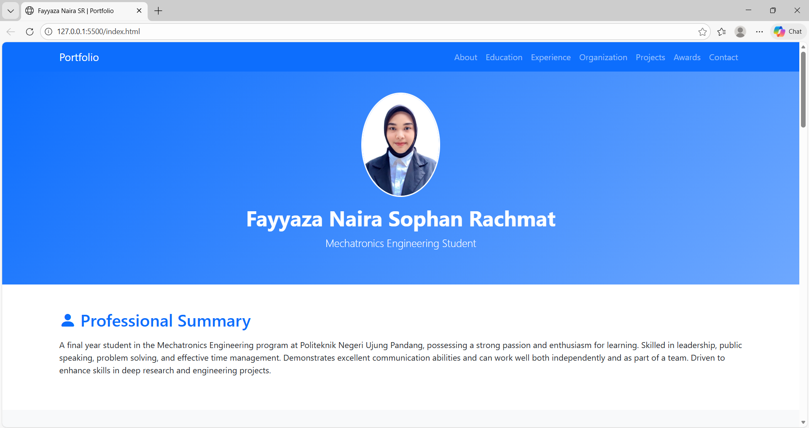

#  Portfolio Website – Fayyaza Naira SR

---

## 🌟 Features
- **Responsive Design** – Optimized for desktop, tablet, and mobile devices
- **Blue & White Theme** – Clean, professional, and academic-oriented UI
- **Bootstrap 5** – Modern responsive framework
- **Sticky Navigation Bar** – Easy navigation between sections
- **Animated Sections** – Smooth fade-in animation on scroll
- **Structured Portfolio Sections** – Education, Experience, Organization, Projects, and Awards
- **Visual Project Gallery** – Project cards with images
- **Professional Layout** – Suitable for academic, research, and engineering purposes

---

## 📂 Project Structure
portfolio-website/
├── assets/
│ └── img/
│ ├── profile.jpeg # Profile photo
│ ├── org1.png
│ ├── org2.png
│ ├── org3.png # Organizational activity photos
│ ├── project1.jpg
│ ├── project2.png
│ ├── project3.png
│ └── project4.png # Project images
├── index.html # Main HTML file
├── README.md # Documentation

## 🎨 Website Sections

### 1. Hero Section
- Profile photo
- Full name
- Academic role (Mechatronics Engineering Student)
- Blue gradient background

### 2. Professional Summary
- Short academic and professional overview
- Focus on leadership, research, and engineering skills

### 3. Education
- Politeknik Negeri Ujung Pandang  
- National Pingtung University of Science and Technology (Taiwan)
- GPA and academic performance

### 4. Experience
- Mechatronics Research Team – Green Campus Project
- Internship at **PT. Pertamina Patra Niaga**
- Engineering and HSSE exposure

### 5. Organizational Experience
- PPI NPUST & IISMA NPUST 2024
- Event coordination and communication roles
- Public Relations & Master of Ceremony experience
- Supported with activity photos

### 6. Projects
- Smart Agriculture using Agro-Drone
- Green Roofs Research
- Engineering Paper Project
- Smart Chicken Cage (Final Project – Microcontrollers)

### 7. Honors & Awards
- IISMA Awardee 2024
- PKM Incentive Scheme Awardee 2024

### 8. Contact
- Phone number
- Email
- LinkedIn profile

👤 Author

Fayyaza Naira Sophan Rachmat
🎓 Mechatronics Engineering Student
📍 Makassar, Indonesia

GitHub: https://github.com/fayyazaasr

Email: fayyazaasr@gmail.com

LinkedIn: https://linkedin.com/in/fayyazasr

Made with 💙 by Fayyaza Naira SR | © 2026 All rights reserved.
